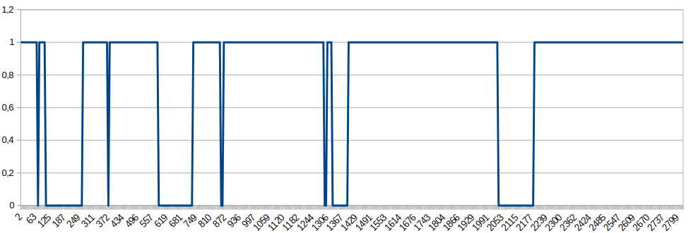

Measure bouncing
================

Description
---------------

Simple program to measure the effect of bouncing on the digital input of your Arduino.
   
While this program takes over the keyboard you have to open a text editor and place the mouse cursor there before testing.
The testresults are written to the text editor.

Save the document as CSV and you can display the results in your favorite spreadsheet.

One remark: this program do not show the real bouncing, but only the effect on the input of the Arduino.

  
Test result
-----------

The tested hardware was a SeeduinoXIAO and I used a morse key as pressbutton
The measure time was set to microseconds.
Done several tests, the image below give a good view how the bouncing affects the digitalread().

I used several morse keys for testing this example was the worst measuring.
After 2188 microseconds the input is stable.
The best result gives a Kent straight key. The bouncing of this key didn't affects the digitalread at all.

73 [PE1HVH ](https://www.pe1hvh.nl)

